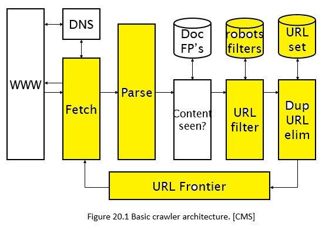

CS- IR Spring 2021 

# Designing WebCrawler

*Figure  SEQ Figure \\* ARABIC 1*

You are given a starter code in the following link for this code.

The modules explained below should correspond to one core function as given in notebook. 

<https://github.com/nNasir/InformationRetrieval/blob/main/code/crawler_startercode.ipynb>

Its recommended  to clone the repo in your local machine. 

1) ## URL Frontier
The URL frontier will be a structure of front queues and back queues, as covered in class. When your crawler starts for the first time, URL frontier will contain seed URLs as given in table 1. 

The process will be multithreaded. Each thread will request a URL from frontier when required. The process of getting data from threads while maintaining politeness and moving data from F-queues to B-queues will be done as studied in class. Prioritizer function is given the starter notebook. 

URLS that go out of frontier should go in some storage (file or in memory list). 

Newly encountered URL’s will be en-queued after passing through URL filtering and Dup-URL elimination module.  

For this project wait for 15 to 20 seconds after sending one request to send another request1. 

*Table  SEQ Table \\* ARABIC 1: Seed URLS*

|**Seed URLS**|
| - |
|https://docs.oracle.com/en/|
|https://www.oracle.com/corporate/|
|https://en.wikipedia.org/wiki/Machine\_learning|
|https://www.csie.ntu.edu.tw/~cjlin/libsvm/index.html|
|https://docs.oracle.com/middleware/jet210/jet/index.html|
|https://en.wikipedia.org/w/api.php|
|https://en.wikipedia.org/api/|
|https://en.wikipedia.org/wiki/Weka\_(machine\_learning)|

You can see example about how multithreaded programming in python while working on shared data here

<https://www.tutorialspoint.com/python/python_multithreading.html>

\1. We are waiting for 15 to 20 seconds to make sure we don’t get blocked by the server

1) ## Fetch
After getting one URL from frontier, retrieve its content from the webserver. If you are working in python use urllib[2] or socket[3] library for this task. If you are working in JAVA you can use similar libraries.  URL (IP or absolute) and content of the fetched page should be stored in database for next modules. You can use database of your own choice. For example you can use Relation databases or simple XML files (your choice will affect the read/write time in this and next modules)
1) ## Parse
Parse the content of the fetched page and retrieve all the URLS from it. The URLS might not be absolute URLS, so make sure you are able to figure out the absolute URL to send to next module.  

For example <http://en.wikipedia.org/wiki/Main_Page> has a relative link to /wiki/Wikipedia:General\_disclaimer which is the same as the absolute URL <http://en.wikipedia.org/wiki/Wikipedia:General_disclaimer>

A lot of this URL links will be of .js .css or .png type. In this assignment we are only interested in HTML pages, so try to make sure the list of URLS you send to next module is of HTML page. (<!DOCTYPE html>)

To parse the HTML page you can use BeautifulSoup[4] in python  or jSoup[5] in JAVA
1) ## URL Filter
In this module you will have to filter the URLs, received from parser, that are restricted from its webserver. The restricted page/s will be given in robot.txt file. To retrieve the robot.txt file of a website use the <home page URL of  website>/robots.txt

For Example: robots.txt of Wikipedia is on following URL 

<https://en.wikipedia.org/robots.txt>

You will obtain this file in the same way as any page you retrieved in fetch module, you should be looking for User-agent: \* in this file to see which page/s are allowed for crawlers and which ones are not. More details on how to read robot.txt is at [1].

Store a local copy of these files for each site, so that you don’t have to fetch it every time.
1) ## Duplicate URL Elimination 
After filtering restricted URLS, check if the newly extracted URLs are already crawled or not. The URLS that pass this test should be added to the frontier (make sure the URLS in frontier are also distinct). 
1) ## Stopping the process
You can stop the process based on number of URL, for example if you have crawler 1000 URLS then you can stop. 
##
## Note:
- You do not have to design “Content-seen” module in this assignment.
- The assignment is to be done individually.
- You will have to submit your jupyter notebook. Your notebook must have the functions given in starter code. Andy other functions and variable can be added if required. 

## Reference

[1] <https://www.promptcloud.com/blog/how-to-read-and-respect-robots-file>

[2] <https://docs.python.org/3/library/urllib.html>

[3] <https://docs.python.org/3/library/socket.html>

[4] <https://www.crummy.com/software/BeautifulSoup/bs4/doc/>

[5] <https://jsoup.org/>

